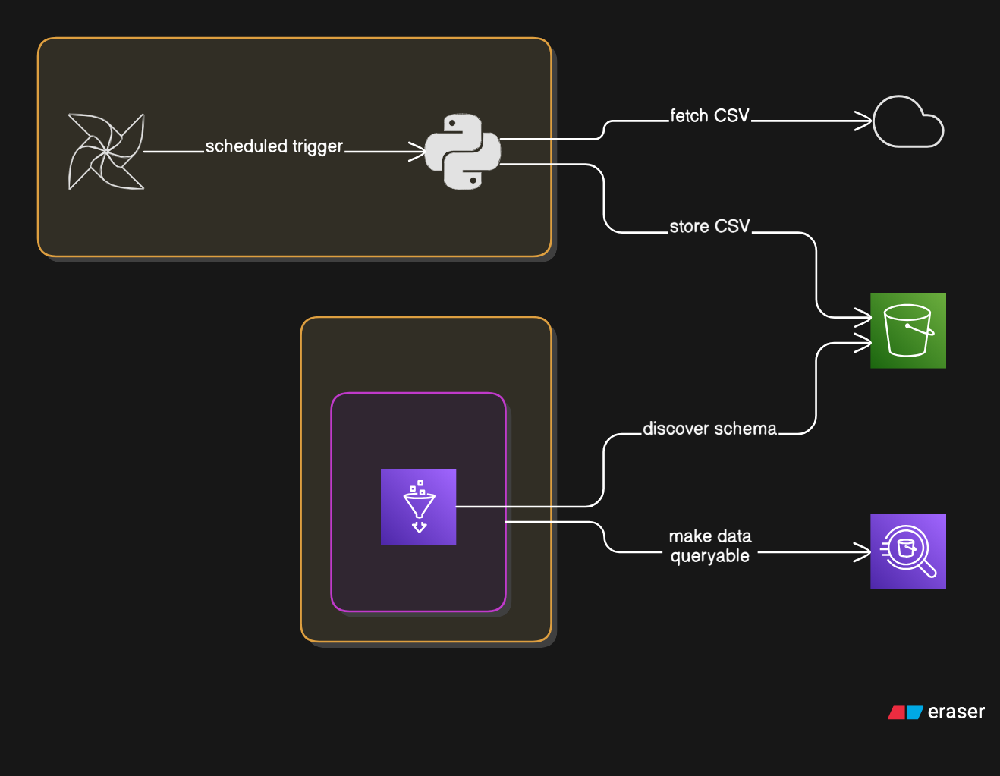

## 🌱 A complete ☁️-native data pipeline that:

- **Extracts** data from the OpenWeather API
- **Transforms** it
- **Loads** it into **AWS S3**, used here as a data lake to store semi-structured data (CSV)

---

## 📦 Pipeline overview

- **Data extraction, transformation & loading (ETL)** to S3 is orchestrated daily with **Apache Airflow**
- **AWS Glue**:
  - Crawls data stored in S3
  - Creates a data catalog (metadata, tables, schema)
- **AWS Athena**:
  - Used to query the cataloged data directly from S3

## ⛏️ Tools used

- **Python**
- **AWS CLI**
- **Apache-Airflow**
- **Amazon Glue**
- **Amazon Athena**
- **Amazon EC2**  

## 🖼️ Diagram of the ETL process.

## How do I run this project?

- You need to sign up for AWS.Learn EC2, S3, Glue and Athena.
- You need your own AWS access and secret keys to configure the project.
- Only then clone this project and run the dag through Airflow.

-------

*Made with lots of ❤️ in VS Code and Python.*
